    
    <h1>Portal API Database Driver</h1>
    <big>Database driver and struct definitions for use with the Portal API</big>
    

     
        
        
        
    

 

# Packages

## 1. Driver

Contains the following interfaces:

- **Driver**: contains all Read & Write methods.
- **Reader**: contains only Read methods and the Notification channel.
- **Writer**: contains only Write methods.

## 2. Postgres Driver

Contains all functionality to interact with Postgres.

- Provides a struct that satisfies the Driver interface.
- Typesafe Go code is generated from SQL schema by SQLC.
- Current Postgres version is `14.3`

## 3. Types

Contains all database structs and their associated methods which are used across the Portal API backend Go repos.

# Development

## `make init`

When starting development work for the first time, run the command **`make init`** from the repository root.

## Code Generation
⚠️ IMPORTANT - Before any commit the default `make` target **MUST** be run. ⚠️

In order for this target to properly generate the Go code and mocks the following dependencies **MUST** be installed.

- [SQLC](https://docs.sqlc.dev/en/stable/overview/install.html)
- [Mockery](https://vektra.github.io/mockery/latest/installation/)

## Modifying Functionality

- Start by updating the `postgresdrver/sqlc/schema.yml` and/or `postgresdrver/sqlc/query.yml` files
- Generate the SQLC Go code from these SQL files using `make`
- Add new functionality to the postgres driver methods and the Driver interface
- Update the driver integration tests in the `Portal DB` repository to cover all code changes
- Once merged to `main` a new version of the DB driver will be published, following semantic versioning standards based on the commit message(s)

## Pre-Commit Installation

Before starting development work on this repo, `pre-commit` must be installed.

In order to do so, run the command **`make init`** from the repository root.

Once this is done, the following checks will be performed on every commit to the repo and must pass before the commit is allowed:

### 1. Basic checks

- **check-yaml** - Checks YAML files for errors
- **check-merge-conflict** - Ensures there are no merge conflict markers
- **end-of-file-fixer** - Adds a newline to end of files
- **trailing-whitespace** - Trims trailing whitespace
- **no-commit-to-branch** - Ensures commits are not made directly to `main`

### 2. Go-specific checks

- **go-fmt** - Runs `gofmt`
- **go-imports** - Runs `goimports`
- **golangci-lint** - run `golangci-lint run ./...`
- **go-critic** - run `gocritic check ./...`
- **go-build** - run `go build`
- **go-mod-tidy** - run `go mod tidy -v`
- **go-unit-tests** - run `go mod tidy -v`

### 3. Detect Secrets

Will detect any potential secrets or sensitive information before allowing a commit.

- Test variables that may resemble secrets (random hex strings, etc.) should be prefixed with `test_`
- The inline comment `pragma: allowlist secret` may be added to a line to force acceptance of a false positive

## Packages in Use

The `make init` command will also install the following Go dependencies globally:

- [SQLC](https://docs.sqlc.dev/en/stable/tutorials/getting-started-postgresql.html) - Generates idiomatic type-safe Go code from SQL schema & queries.
- [Mockery](https://github.com/vektra/mockery) - Generates a mock from the Driver interface for testing purposes.
- [mermerd](https://github.com/KarnerTh/mermerd) - Generates a mermaid diagram for the README.md on every run of the E2E tests and commit.

## Generating code

**Before committing any code to the repo, run the default Make target (`make`)**

This will used SQLC to generate Go code. It is also a useful way to check the `schema.sql` and `query.sql` files for SQL errors.

In addition, it will generate a mock of the `Driver` interface for testing purposes. This mock will automatically reflect changes made to the SQL schema files.

# Current Schema

```mermaid
erDiagram
    account_integrations {
        character_varying account_id FK
        character_varying covalent_api_key_free
        character_varying covalent_api_key_paid
        timestamp_with_time_zone created_at
        integer id PK
        timestamp_with_time_zone updated_at
    }

    account_user_access {
        boolean accepted
        character_varying account_id FK
        timestamp_with_time_zone created_at
        integer id PK
        boolean owner
        character_varying portal_application_id FK
        character_varying role_name FK
        timestamp_with_time_zone updated_at
        character_varying user_id FK
    }

    accounts {
        timestamp_with_time_zone created_at
        boolean deleted
        timestamp_with_time_zone deleted_at
        character_varying id PK
        integer partner_application_limit
        ARRAY partner_chain_ids
        integer partner_throughput_limit
        character_varying plan_type FK
        timestamp_with_time_zone updated_at
    }

    chain_aliases {
        character_varying alias PK
        character_varying chain_id PK
        timestamp_with_time_zone created_at
    }

    chain_altruists {
        character_varying auth
        chain_auth_type auth_type
        character_varying chain_id FK
        timestamp_with_time_zone created_at
        integer id PK
        timestamp_with_time_zone updated_at
        character_varying url
    }

    chain_checks {
        integer allowance
        character_varying chain_id FK
        timestamp_with_time_zone created_at
        integer evm_chain_id
        integer id PK
        character_varying payload
        character_varying result_key
        chain_check_type type
        timestamp_with_time_zone updated_at
    }

    chains {
        boolean active
        ARRAY allowed_methods
        timestamp_with_time_zone created_at
        boolean deleted
        timestamp_with_time_zone deleted_at
        character_varying description
        character_varying enforce_result
        character_varying id PK
        integer log_limit_blocks
        character_varying path
        integer request_timeout
        character_varying ticker
        timestamp_with_time_zone updated_at
    }

    chains_gigastake_applications {
        character_varying chain_id PK
        character_varying gigastake_application_id PK
    }

    gigastake_applications {
        character_varying address
        character_varying client_public_key
        timestamp_with_time_zone created_at
        boolean deleted
        timestamp_with_time_zone deleted_at
        character_varying id PK
        character_varying name
        character_varying public_key
        character_varying signature
        character_varying test
        timestamp_with_time_zone updated_at
        character_varying version
    }

    global_blocked_contracts {
        boolean active
        character_varying blocked_address
        timestamp_with_time_zone created_at
        integer id PK
        timestamp_with_time_zone updated_at
    }

    pay_plans {
        integer application_limit
        ARRAY chain_ids
        timestamp_with_time_zone created_at
        integer daily_limit
        integer monthly_relay_limit
        character_varying plan_type PK
        integer throughput_limit
        timestamp_with_time_zone updated_at
    }

    portal_application_aats {
        character_varying address
        character_varying client_public_key
        character_varying id PK
        character_varying portal_application_id FK
        character_varying private_key
        character_varying public_key
        character_varying signature
        character_varying version
    }

    portal_application_notifications {
        boolean active
        character_varying application_id FK
        character_varying destination
        ARRAY events
        integer id PK
        character_varying trigger
        notification_type type
        timestamp_with_time_zone updated_at
    }

    portal_application_settings {
        character_varying application_id FK
        environment environment
        ARRAY favorited_chain_ids
        integer id PK
        integer monthly_relay_limit
        character_varying secret_key
        boolean secret_key_required
        timestamp_with_time_zone updated_at
    }

    portal_application_whitelists {
        character_varying application_id FK
        character_varying chain_id
        timestamp_with_time_zone created_at
        integer id PK
        whitelist_type type
        character_varying value
    }

    portal_applications {
        character_varying account_id FK
        timestamp_with_time_zone created_at
        integer custom_limit
        integer daily_limit
        boolean deleted
        timestamp_with_time_zone deleted_at
        timestamp_with_time_zone first_date_surpassed
        character_varying id PK
        character_varying name
        character_varying plan_type
        integer request_timeout
        timestamp_with_time_zone updated_at
    }

    user_auth_providers {
        timestamp_with_time_zone created_at
        boolean federated
        integer id PK
        auth_provider provider
        character_varying provider_user_id
        auth_type type
        character_varying user_id FK
    }

    user_roles {
        timestamp_with_time_zone created_at
        ARRAY permissions
        character_varying role_name PK
        timestamp_with_time_zone updated_at
    }

    users {
        timestamp_with_time_zone created_at
        character_varying email
        character_varying id PK
        boolean signed_up
        timestamp_with_time_zone updated_at
    }

    account_integrations }o--|| accounts : "account_id"
    account_user_access }o--|| accounts : "account_id"
    account_user_access }o--|| portal_applications : "portal_application_id"
    account_user_access }o--|| user_roles : "role_name"
    account_user_access }o--|| users : "user_id"
    accounts }o--|| pay_plans : "plan_type"
    portal_applications }o--|| accounts : "account_id"
    chain_aliases }o--|| chains : "chain_id"
    chain_altruists }o--|| chains : "chain_id"
    chain_checks }o--|| chains : "chain_id"
    chains_gigastake_applications }o--|| chains : "chain_id"
    chains_gigastake_applications }o--|| gigastake_applications : "gigastake_application_id"
    portal_application_aats }o--|| portal_applications : "portal_application_id"
    portal_application_notifications }o--|| portal_applications : "application_id"
    portal_application_settings }o--|| portal_applications : "application_id"
    portal_application_whitelists }o--|| portal_applications : "application_id"
    user_auth_providers }o--|| users : "user_id"
```

